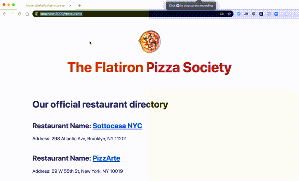

# Rails Code Challenge - Pizza Restaurants

For this assessment, you'll be working with a Pizza Restaurant domain.

In this repo, there is a Rails application with some features built out. Your job is to extend this code to add the functionality described in the deliverables below.

## Topics

- MVC
- REST
- Request-Response Cycle
- Forms and Form Helpers
- ActiveRecord
- Validations

## Setup

Before you begin coding your solution, clone this repo and then `cd` into it. Then run `bundle install`, `rails db:migrate`, and `rails db:seed` to install dependencies and set up the database, and run `rails s` to start the server.

## Domain

There are three models in the domain: Restaurant, Pizza, and a join model RestaurantPizza.

Each Restaurant can have many Pizzas. Each Pizza can belong to multiple Restaurants.

## What You Already Have

The starter code has migrations, models, and seed data for the initial Pizza and Restaurant models. There are routes, controllers and views to support listing Restaurants and Pizzas.

Once you have followed the setup instructions above, visiting the `/restaurants` route will display all of the Restaurants. Similarly, visiting `/pizzas` will list all the pizzas.

***Schema***

Restaurant

| Column | Type |
| ------------- | ------------- |
| name | String |
| address | String |

Pizza

| Column | Type |
| ------------- | ------------- |
| name  | String  |
| ingredients | String  |
| created_at  | DateTime  |
| updated_at  | DateTime  |

## Instructions

Update the code of the application to meet the following deliverables. Follow RESTful naming conventions and the MVC pattern to divide responsibility.

***Read through these deliverables carefully to understand the requirements for this code challenge. Tackle them one by one, as they build on each other sequentially.***

### 1. Create the RestaurantPizza Association

Each Restaurant can have many Pizzas and each Pizza can belong to multiple Restaurants. Each Restaurant can set the price of a Pizza to an integer. Update the schema and models to create the RestaurantPizza relationship so that:

- A Pizza can be sold at many Restaurants
- A Restaurant can sell many Pizzas
- RestaurantPizza stores an integer price for each pizza (Remember, each Restaurant can choose how to price its own Pizzas)

### 2. Pizza Show Page

There should be a show page for each Pizza. It should display the name and ingredients.

### 3. Restaurant Show Page

There should be a show page for each Restaurant. It should include:

- the Restaurant's name and address
- a list of the Pizzas it sells

Each pizza in the list should link to that Pizza's show page.

### 4. Restaurants Index Page Links

On the Restaurant index page, each Restaurant's name should link to the restaurant's show page.

### 5. RestaurantPizza Form

Add controller actions and views necessary to show a form to associate a Pizza with a Restaurant. The user can:

- Choose an existing Pizza from a select dropdown
- Choose an existing Restaurant from a select dropdown
- Enter a numeric price
- Click a button to save the RestaurantPizza association

After submitting, the user should be redirected to the selected Restaurant's show page.

### 6. RestaurantPizza Validation

Add validations to the RestaurantPizza model so that each RestaurantPizza must have:

- A price between 1 and 30
- Add handling for this error to the RestaurantPizza create action
- The validation error should be shown on the RestaurantPizza creation form when a user attempts to save a RestaurantPizza with an invalid price

### 7. Advanced: Additional RestaurantPizza Validation

A Pizza should only be associated with the same Restaurant once. (It wouldn't make sense for Pizza Hut to have Cheese Pizza listed on its menu twice!)

Add a validation to RestaurantPizza to ensure that each Pizza can only appear once on the same Restaurant's menu.
Update the error handling on the RestaurantPizza creation form to show this validation error.

### 8. Advanced: Display Count of Restaurants on Pizza Index Page

On the Pizza index page, display the number of Restaurants that have that Pizza next to each Pizza's name.

### 9. Advanced: Restaurant Average Pizza Price

Show the average price of a Pizza on the Restaurant show page. 

To calculate the average, add up all of the Restaurant's Pizzas' prices, and then divide by the number of Pizzas.

### Feature Demo

## Rubric

### Models, Associations, and Validations

1. Models, associations, and validation not started or have errors that prevent the application from running. Missing validations, or validation syntax is incorrect. May have introduced models outside the specified domain.
2. Models, associations, and validations attempted but incomplete or have errors. Associations may construct the wrong relationships. Validations may be missing or applied to the wrong models. Advanced query methods incomplete or have errors.
3. Models, associations, and validations mostly complete and correct per the deliverables. Advanced validations and methods may be incomplete. May have unused or unnecessary code, possibly including duplication. May have written validations instead of using appropriate built-in validations. May implement advanced query methods with iterators instead of using built-in methods.
4. All models, associations, and validations are complete and correct, save minor mistakes in advanced deliverables. Advanced validations are complete and add informative error messages.
5. All specified models, associations, and validations complete and correct. Built-in validations are used when appropriate. Variable and method names are intention-revealing. Models have appropriate logic extracted from controllers and views. Advanced query methods use appropriate built-in methods.

### Routes, Controllers, and REST

1. Routes missing, naming does not follow REST, controller actions incomplete or with errors.
2. Some routing and controller logic implemented, but incompletely or incorrectly. May have routes or controller actions not included in the deliverables. May include routes that have no corresponding controller action or vice versa. Controller methods might do work beyond their responsibility in MVC.
3. Most routing and controller logic working as specified. Some advanced deliverables may be incomplete. Routing follows REST convention. Routing table might include some unused routes, or routes and actions that were not specified in the deliverables. Logic may be duplicated between methods.
4. Nearly all routing and controller deliverables completed, possibly with minor errors in advanced deliverables. Routing follows REST conventions. Some logic may be duplicated between controller actions, or not respect MVC separation of concerns. Attempts to use filters and private helper methods to reduce duplication, but some duplication may remain.
5. All routes and controllers deliverables work as described in the instructions. Routing follows REST naming conventions. Controller actions respect MVC separation of concerns, and don't have logic that belongs in the model or the view. ActionController filters and private helper methods are used appropriately to reduce duplication in controller actions.

### Views and Forms

1. Missing or unattempted views and forms, or erb syntax errors in views and forms. Forms created in the wrong views, do not accept the correct input, or do not submit to the correct location. Data not displayed correctly.
2. Views display some data correctly. Forms attempted, but with some errors that prevent submitting data correctly. May not have attempted or may have significant errors in advanced deliverables.
3. Uses view to show data as specified. At least one working form that submits data to the correct location. May not have attempted some advanced view features. May have included views not specified by the deliverables. May include model or controller logic in the view. Forms may accept invalid input (for example, out of range numbers). May not display validation errors correctly. May not use view helper methods to reduce duplication.
4. Nearly all view and form deliverables are complete and correct. May have minor logic errors in advanced deliverables. Mostly does not include controller or model logic in the views. Mostly uses helpers to reduce duplication.
5. All view and form deliverables are complete and correct, including advanced form components. No views not specified by the instructions. No model or controller logic present in the views. Appropriate use of helpers and built-ins to reduce duplication. Validation errors displayed correctly on form.
